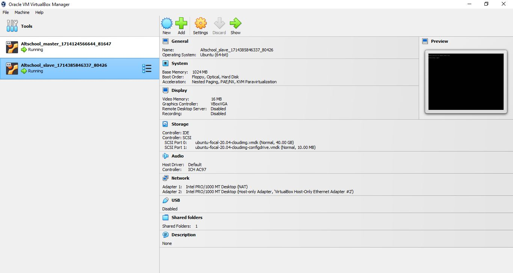
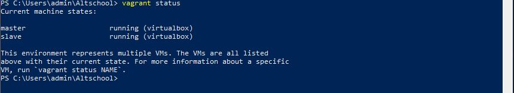
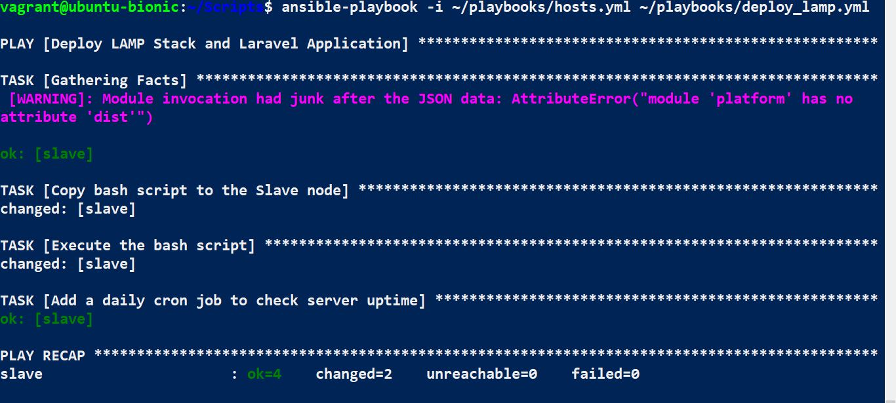
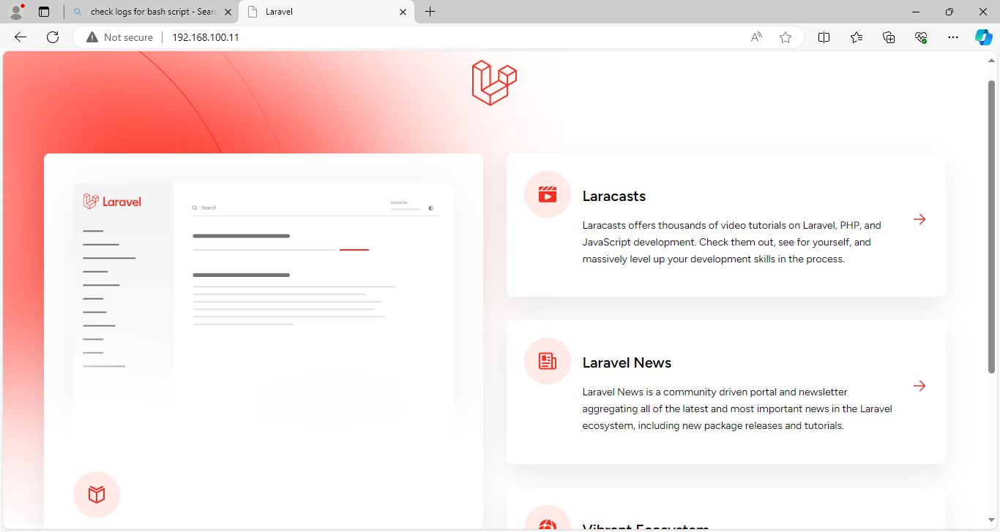

# Altschool Cloud Exam
## Question
Objective
Automate the provisioning of two Ubuntu-based servers, named "Master" and "Slave", using Vagrant.
On the Master node, create a bash script to automate the deployment of a LAMP (Linux, Apache, MySQL, PHP) stack.
This script should clone a PHP application from GitHub, install all necessary packages, and configure Apache web server and MySQL. 
Ensure the bash script is reusable and readable.
Using an Ansible playbook:
Execute the bash script on the Slave node and verify that the PHP application is accessible through the VM's IP address (take screenshot of this as evidence)
Create a cron job to check the server's uptime every 12 am.

Requirements
Submit the bash script and Ansible playbook to (publicly accessible) GitHub repository.
Document the steps with screenshots in md files, including proof of the application's accessibility (screenshots taken where necessary)
Use either the VM's IP address or a domain name as the URL.

PHP Laravel GitHub Repository:
https://github.com/laravel/laravel

## Solution 
1. Create Master and Slave VMs using vagrant.
~~~ Vagrant.configure("2") do |config|
  config.vm.define "master" do |master|
    master.vm.box = "ubuntu/bionic64"
    master.vm.network "private_network", ip: "192.168.100.10"
    master.vm.provider "virtualbox" do |vb|
      vb.memory = "1024"
      vb.cpus = 1
    end
  end

  config.vm.define "slave" do |slave|
    slave.vm.box = "ubuntu/focal64"
    slave.vm.network "private_network", ip: "192.168.100.11"
    slave.vm.provider "virtualbox" do |vb|
      vb.memory = "1024"
      vb.cpus = 1
    end
  end
end
~~~

 

2. On the Master node, create a bash script to automate the deployment of a LAMP (Linux, Apache, MySQL, PHP) stack.
[Bash Script](deploy_lamp.sh)

3. Using an Ansible playbook:
Execute the bash script on the Slave node and verify that the PHP application is accessible through the VM's IP address (take screenshot of this as evidence)
[Ansible Playbook](deploy_lamp.yml)

